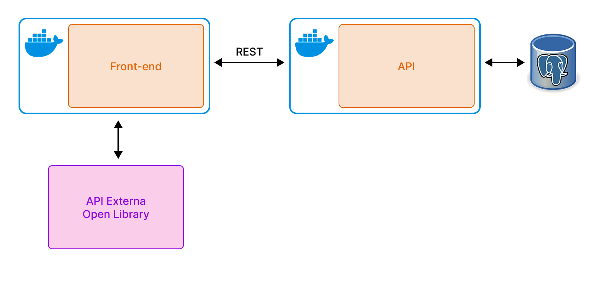

# Architecture

Diagrams of Nós no Cabo: this client (`nos-client`) and its backend (`nos-sr`).
They are also published, with an interactive map, at
[docs.nosnocabo.com.br](https://docs.nosnocabo.com.br) (source in [`../site/`](../site)).

- **v0** is the first version: a Dockerized SPA and a Flask API with Postgres.
- **v1** is the system running now: a React SPA and Cloudflare Workers.
- [`decisions/`](decisions) records why v1 looks the way it does.

## v0



## v1

### System

- [`00-system-context`](v1/00-system-context.puml): actors, the SPA, the gateway, the router, the services and third parties
- [`01-deployment`](v1/01-deployment.puml): every Worker with its domain, D1s, queues, crons and bindings

### Backend (nos-sr)

- [`10-services`](v1/backend/10-services.puml): what each Worker serves, `CatalogRpc` and `MetricsRpc`, and who owns which data
- [`11-data-model`](v1/backend/11-data-model.puml): the catalog and metrics D1 schemas
- [`12-website-lifecycle`](v1/backend/12-website-lifecycle.puml): checking → published / rejected, review, and unverified ⇄ verified
- [`13-api-contract`](v1/backend/13-api-contract.puml): the `/v1` API and the redirects, from `@nosnocabo/contract`
- [`14-seq-submit-moderation`](v1/backend/14-seq-submit-moderation.puml): submission, the moderation queue and the daily AI budget
- [`15-seq-verification`](v1/backend/15-seq-verification.puml): widget verification, on request and hourly
- [`16-seq-clicks-ranking`](v1/backend/16-seq-clicks-ranking.puml): clicks through the router, votes, and the "Melhores" score
- [`17-seq-web-push`](v1/backend/17-seq-web-push.puml): notifying submitters who left
- [`18-seq-report-review`](v1/backend/18-seq-report-review.puml): reports, alert emails and review by reply

### Frontend (nos-client)

- [`20-modules`](v1/frontend/20-modules.puml): feature folders and their deliberate cross-feature imports
- [`21-seq-submit-optimistic`](v1/frontend/21-seq-submit-optimistic.puml): the submit form, the local draft and its status checks
- [`22-routes`](v1/frontend/22-routes.puml): the route map
- [`23-data-layer`](v1/frontend/23-data-layer.puml): query and mutation hooks → `/v1` endpoints, and MSW

### UML

Every UML 2 diagram type, drawn from v1. The new ones live in [`v1/uml/`](v1/uml); the others
are the diagrams above.

| UML type | Diagram |
| --- | --- |
| Use case | [`30-use-case`](v1/uml/30-use-case.puml) |
| Class | [`31-class-domain`](v1/uml/31-class-domain.puml), [`32-class-interfaces`](v1/uml/32-class-interfaces.puml) |
| Object | [`33-object-snapshot`](v1/uml/33-object-snapshot.puml) |
| Package | [`34-package`](v1/uml/34-package.puml) |
| Composite structure | [`35-composite-catalog`](v1/uml/35-composite-catalog.puml) |
| Profile | [`36-profile`](v1/uml/36-profile.puml) |
| Component | [`10-services`](v1/backend/10-services.puml), [`20-modules`](v1/frontend/20-modules.puml) |
| Deployment | [`01-deployment`](v1/01-deployment.puml) |
| Activity | [`37-activity-submission`](v1/uml/37-activity-submission.puml), [`38-activity-ring-redirect`](v1/uml/38-activity-ring-redirect.puml) |
| State machine | [`12-website-lifecycle`](v1/backend/12-website-lifecycle.puml), [`39-state-draft`](v1/uml/39-state-draft.puml) |
| Sequence | [`14`](v1/backend/14-seq-submit-moderation.puml)–[`18`](v1/backend/18-seq-report-review.puml), [`21-seq-submit-optimistic`](v1/frontend/21-seq-submit-optimistic.puml) |
| Communication | [`40-communication-website-page`](v1/uml/40-communication-website-page.puml) (PlantUML has no native form; objects with numbered links) |
| Interaction overview | [`41-interaction-overview`](v1/uml/41-interaction-overview.puml) |
| Timing | [`42-timing-submission`](v1/uml/42-timing-submission.puml) |

## Decisions

- [0001: Community registration and widget verification](decisions/0001-community-registration-and-verification.md)
- [0002: Move the backend to Cloudflare Workers](decisions/0002-cloudflare-platform.md)
- [0003: Optimistic draft submissions](decisions/0003-optimistic-draft-submissions.md)
- [0004: "Melhores" ranking, computed by the backend](decisions/0004-ranking.md)
- [0005: Derived data: stored, owned, rebuildable](decisions/0005-derived-data.md)
- [0006: Metrics: cookieless clicks, net likes](decisions/0006-metrics.md)

## Legend

Every diagram includes [`_style.iuml`](_style.iuml).

| Colour / stereotype | Meaning |
| --- | --- |
| Blue `<<external>>` | Third-party system or service |
| Grey dashed `<<private>>` | The moderation Worker; its code is in a private repo, so it is drawn as a black box |
| Orange `<<cron>>` | Cron Trigger |
| Red arrows (frontend) | A deliberate import across feature folders |

## Rendering

- **VS Code:** the *PlantUML* extension (jebbs.plantuml), `Alt+D` to preview.
- **Export everything (Docker, includes Graphviz):**
  ```sh
  pnpm docs:diagrams                                  # PNG → out/architecture/
  pnpm docs:diagrams /tmp/diagrams svg                # custom folder and format
  ```
  [`export-diagrams.sh`](export-diagrams.sh) mirrors the folder layout
  (`out/architecture/v1/backend/10-services.png`, …), lists each diagram as `ok` or `FAIL`,
  and exits non-zero when any diagram has a syntax or include error. It uses PlantUML's pipe
  mode because the container cannot write into a bind-mounted folder on this WSL/Docker setup.
- **Docs site:** `pnpm docs:site:dev` to work on it, `pnpm deploy:docs` to publish it.

Keep rendered output out of git; the `.puml` files are the source of truth.

## Maintenance

- Update a diagram in the same change as the code it describes.
- The map on the docs site ([`../site/src/architecture.ts`](../site/src/architecture.ts)) is an
  overview of the same system: when a Worker, binding, store or flow changes, update it too.
- v0 is frozen. A new decision gets the next ADR number; an ADR is superseded, not edited.
- Moderation stays a black box: never describe its policy in this public repo.
